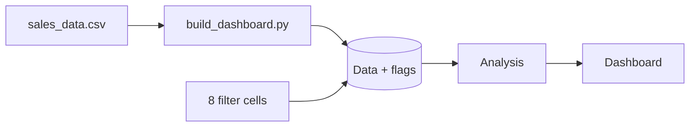

<div align="center">

# Sales Performance Dashboard (Excel)

**A formula-driven, cross-filtering Excel dashboard that is generated, tested and reproducible.**

[](https://github.com/YOUR-USER/sales-dashboard-excel/actions/workflows/ci.yml)


</div>

## Why this project

Most "Excel dashboards" are binary files nobody can review, diff or test. This one is **built from code**: the workbook is generated from a CSV, every figure is a live formula, and a test suite recalculates the file and checks the results against an independent pandas calculation.

| | |
|---|---|
| **8 linked filters** | Region, Country, Channel, Customer Type, Category, Product, From / To month. Every KPI, chart and map tile responds to all of them. |
| **Power BI-style highlighting** | Each chart ignores its own filter and greys out non-selected items, so context is never lost. |
| **6 KPI cards + highlights strip** | Revenue, Gross Profit, Margin, Units, Avg Order Value, Avg Unit Price; top country / month / category / channel / customer / product. |
| **6 native charts + tile map** | Combo trend, category, top-5 products, top-10 countries, channel, customer type, plus a shaded tile map of Europe. |
| **Optional click-to-filter (VBA)** | Click a bar, month or map tile to filter the whole dashboard. |
| **Tested** | 5 pytest tests: structure, no hard-coded KPIs, and 3 filter scenarios reconciled to pandas to the cent. |
| **CI + 4K export** | GitHub Actions builds, tests and renders a 3840 px PNG on every push. |

### Filtered example (Category = Camping, Country = Germany)


## Quick start

**Just use it:** open [`dashboard/Sales_Performance_Dashboard.xlsx`](dashboard/Sales_Performance_Dashboard.xlsx), pick values in the orange filter cells.
(The file recalculates on open, so previews in browsers or on mobile may look empty until opened in Excel.)

**Rebuild from source:**
```bash
git clone https://github.com/YOUR-USER/sales-dashboard-excel.git && cd sales-dashboard-excel
python -m venv .venv && source .venv/bin/activate
make install
make build      # data/sales_data.csv -> dashboard/Sales_Performance_Dashboard.xlsx
make test       # needs LibreOffice for the numeric tests
make png        # 4K PNG, needs LibreOffice + poppler-utils
```

**Use your own data:** replace `data/sales_data.csv` (same 12 columns, see [data dictionary](docs/data-dictionary.md)) and run `make build`.

**Enable click-to-filter:** follow [`macros/README.md`](macros/README.md) (about 2 minutes).

## How it works
Each row of the `Data` table carries `In Filter` and six `Flag excl. <dimension>` columns. Every number is a `SUMIFS` on one of those flags. A chart for dimension *X* uses the flag that leaves *X* out, then splits values into *Selected* and *Excluded* series for the highlight effect.
Details, diagrams and design decisions: [`docs/architecture.md`](docs/architecture.md).



## Repository layout
```
.
├── src/build_dashboard.py        # workbook generator (openpyxl)
├── data/sales_data.csv           # 2,707 orders, FY2026
├── dashboard/                    # built workbook
├── macros/                       # optional click-to-filter VBA
├── scripts/                      # recalc (LibreOffice) + 4K PNG export
├── tests/                        # pytest: structure + numbers vs pandas
├── docs/                         # architecture, data dictionary, review, pivot guide
├── assets/                       # screenshots
└── .github/                      # CI, issue / PR templates
```

## Headline numbers (FY2026, unfiltered)
Revenue **$645,223** | Gross profit **$296,384** (45.9%) | Units **6,698** | Orders **2,707** | Avg order value **$238.35** | Avg net unit price **$96.33**.

## Honest limitations
- No real PivotTables, slicers, timeline or filled-map chart: openpyxl cannot write them. The same behaviour is achieved with formulas; a manual route is in [`docs/pivot-build-guide.md`](docs/pivot-build-guide.md).
- Click-to-filter needs desktop Excel + macros and is not covered by CI (no Excel runner).
- Visual QA was done through LibreOffice rendering; typography may differ slightly in Excel.
- Formula ranges cover the rows present at build time.

## Roadmap
- [ ] Year-over-year comparison once multi-year data is available
- [ ] Optional native-PivotTable edition via Excel automation
- [ ] Power BI / Looker Studio twin from the same CSV

## Contributing
See [CONTRIBUTING.md](CONTRIBUTING.md). Issues and PRs welcome.

## License
[MIT](LICENSE)
