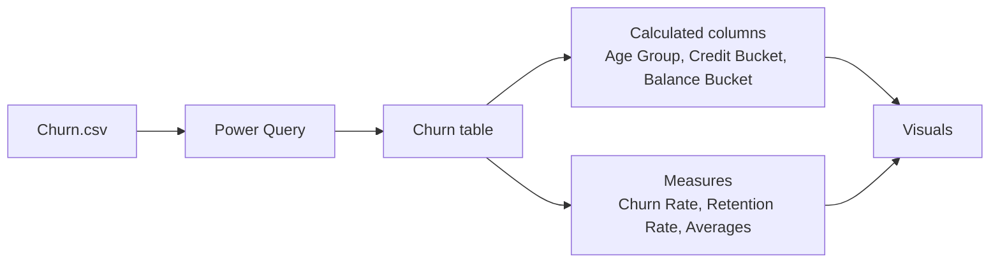

<p align="center">
  
  
  
  
  
</p>

# Bank Customer Churn Analysis - Power BI Dashboard 

An interactive, presentation-grade Power BI dashboard that shows **who leaves a bank, and why**. It covers 10,000 customers across France, Germany and Spain, and comes with a custom Figma-style dark background, a reusable Power BI theme, ready-to-paste DAX, and a full design guide.

--- 

##  Live dashboard 

<svg xmlns="http://www.w3.org/2000/svg" width="1280" height="520" viewBox="0 0 1280 520" xmlns:c2pa="http://c2pa.org/manifest"><metadata><c2pa:manifest>AAAWgmp1bWIAAAAeanVtZGMycGEAEQAQgAAAqgA4m3EDYzJwYQAAABZcanVtYgAAAEdqdW1kYzJtYQARABCAAACqADibcQN1cm46YzJwYTozN2MxMGJjNi00NGEzLTRhYmEtODE1MC1lODNkZTFmZWZkMzAAAAADl2p1bWIAAAApanVtZGMyYXMAEQAQgAAAqgA4m3EDYzJwYS5hc3NlcnRpb25zAAAAALxqdW1iAAAARGp1bWRjYm9yABEAEIAAAKoAOJtxE2MycGEuaW5ncmVkaWVudC52MwAAAAAYYzJzaLFAUFHJMA81sAPIOGDTSd4AAABwY2JvcqNpZGM6Zm9ybWF0bWltYWdlL3N2Zyt4bWxqaW5zdGFuY2VJRHgseG1wOmlpZDpjNzdjMDI1NC00Nzk0LTQxMjEtOWMxYS1jYWMzZjNhMDM5MDZscmVsYXRpb25zaGlwaHBhcmVudE9mAAAB4mp1bWIAAABBanVtZGNib3IAEQAQgAAAqgA4m3ETYzJwYS5hY3Rpb25zLnYyAAAAABhjMnNoZHRusaEIhHxAOuK9U6UjVgAAAZljYm9yomdhY3Rpb25zgqJmYWN0aW9ua2MycGEub3BlbmVkanBhcmFtZXRlcnOha2luZ3JlZGllbnRzgaJjdXJseC1zZWxmI2p1bWJmPWMycGEuYXNzZXJ0aW9ucy9jMnBhLmluZ3JlZGllbnQudjNkaGFzaFggIEuNVVPsXGEBl1tgCBlYh8hsGvfnB66ul65FOhqNwk6kZmFjdGlvbngdY29tLmFudGhyb3BpYy5jbGF1ZGUucHJvdmlkZWRqcGFyYW1ldGVyc6F4H2NvbS5hbnRocm9waWMub3JpZ2luLWNvbmZpZGVuY2VndW5rbm93bmtkZXNjcmlwdGlvbnhmQ2xhdWRlIHByb3ZpZGVkIHRoaXMgZmlsZSBhdCB0aGUgcmVxdWVzdCBvZiBhIHVzZXIgYW5kIG1heSBoYXZlIGNyZWF0ZWQgb3IgbW9kaWZpZWQgdGhlIGZpbGUgY29udGVudHMubXNvZnR3YXJlQWdlbnShZG5hbWVmQ2xhdWRlcmFsbEFjdGlvbnNJbmNsdWRlZPUAAADIanVtYgAAAEBqdW1kY2JvcgARABCAAACqADibcRNjMnBhLmhhc2guZGF0YQAAAAAYYzJzaNDigD2iW5JKZBlBpRZe26YAAACAY2JvcqVjYWxnZnNoYTI1NmNwYWRNAAAAAAAAAAAAAAAAAGRoYXNoWCAbzbGJbhbYnZ6L7jZULK+x5u8it3HmGefixOsSbY2og2RuYW1lbmp1bWJmIG1hbmlmZXN0amV4Y2x1c2lvbnOBomVzdGFydBiYZmxlbmd0aBkeBAAAAj5qdW1iAAAAJ2p1bWRjMmNsABEAEIAAAKoAOJtxA2MycGEuY2xhaW0udjIAAAACD2Nib3KlY2FsZ2ZzaGEyNTZpc2lnbmF0dXJleE1zZWxmI2p1bWJmPS9jMnBhL3VybjpjMnBhOjM3YzEwYmM2LTQ0YTMtNGFiYS04MTUwLWU4M2RlMWZlZmQzMC9jMnBhLnNpZ25hdHVyZWppbnN0YW5jZUlEeCx4bXA6aWlkOjM3ZTIyM2M1LTllNjgtNDRiZi04ODEzLTczM2EwODBmNmI2Y3JjcmVhdGVkX2Fzc2VydGlvbnODomN1cmx4LXNlbGYjanVtYmY9YzJwYS5hc3NlcnRpb25zL2MycGEuaW5ncmVkaWVudC52M2RoYXNoWCAgS41VU+xcYQGXW2AIGViHyGwa9+cHrq6XrkU6Go3CTqJjdXJseCpzZWxmI2p1bWJmPWMycGEuYXNzZXJ0aW9ucy9jMnBhLmFjdGlvbnMudjJkaGFzaFggXDhIfC07A0kHgpZOKLd/V3+k8lpp3Li+/26SloYqMsqiY3VybHgpc2VsZiNqdW1iZj1jMnBhLmFzc2VydGlvbnMvYzJwYS5oYXNoLmRhdGFkaGFzaFggDVZFpPaTpMU7PtD1gt937Zwp96Mbv3Tszvxr4ca1K490Y2xhaW1fZ2VuZXJhdG9yX2luZm+jZG5hbWVvQW50aHJvcGljIEZpbGVzZ3ZlcnNpb25lMS4wLjBrc3BlY1ZlcnNpb25lMi40LjAAABA4anVtYgAAAChqdW1kYzJjcwARABCAAACqADibcQNjMnBhLnNpZ25hdHVyZQAAABAIY2JvctKEWQISogEmGCFZAgowggIGMIIBjaADAgECAhRA5aAK7sI50L64g/oGQgU9Z1UTADAKBggqhkjOPQQDAzBJMRcwFQYDVQQKEw5BbnRocm9waWMsIFBCQzEuMCwGA1UEAxMlQW50aHJvcGljIENvbnRlbnQgQ3JlZGVudGlhbHMgUm9vdCBDQTAeFw0yNjA4MDcxODQzNTZaFw0yODA4MDYxOTQzNTZaMEQxFzAVBgNVBAoTDkFudGhyb3BpYywgUEJDMSkwJwYDVQQDEyBBbnRocm9waWMgQ2xhdWRlIENvbnRlbnQgU2lnbmluZzBZMBMGByqGSM49AgEGCCqGSM49AwEHA0IABJh6CmvLUBgFFNU0vUKlOVtE6djd17L5SuwX0LemFisBM3dkd/3cyjxFA3Qo5S46fX0/ihY0VZ7mfb9KF703t5OjWDBWMA4GA1UdDwEB/wQEAwIHgDAVBgNVHSUEDjAMBgorBgEEAYPoXgIBMAwGA1UdEwEB/wQCMAAwHwYDVR0jBBgwFoAUzlHiBIFOZFsj+OPEz5o+nMHXXMIwCgYIKoZIzj0EAwMDZwAwZAIwMXMdFJ4BetLLVY7ORuE9noqbbAZOZn/aArXyTwFAZfKrPzxF2vPoJNf1+UCdg1XGAjBwX1zd9WGqYkqmL5SFqw1QySjr1zJfpJM9+1rdDwSPLMOPOjKuiXjoU/pUUeG9RwmhY3BhZFkNngAAAAAAAAAAAAAAAAAAAAAAAAAAAAAAAAAAAAAAAAAAAAAAAAAAAAAAAAAAAAAAAAAAAAAAAAAAAAAAAAAAAAAAAAAAAAAAAAAAAAAAAAAAAAAAAAAAAAAAAAAAAAAAAAAAAAAAAAAAAAAAAAAAAAAAAAAAAAAAAAAAAAAAAAAAAAAAAAAAAAAAAAAAAAAAAAAAAAAAAAAAAAAAAAAAAAAAAAAAAAAAAAAAAAAAAAAAAAAAAAAAAAAAAAAAAAAAAAAAAAAAAAAAAAAAAAAAAAAAAAAAAAAAAAAAAAAAAAAAAAAAAAAAAAAAAAAAAAAAAAAAAAAAAAAAAAAAAAAAAAAAAAAAAAAAAAAAAAAAAAAAAAAAAAAAAAAAAAAAAAAAAAAAAAAAAAAAAAAAAAAAAAAAAAAAAAAAAAAAAAAAAAAAAAAAAAAAAAAAAAAAAAAAAAAAAAAAAAAAAAAAAAAAAAAAAAAAAAAAAAAAAAAAAAAAAAAAAAAAAAAAAAAAAAAAAAAAAAAAAAAAAAAAAAAAAAAAAAAAAAAAAAAAAAAAAAAAAAAAAAAAAAAAAAAAAAAAAAAAAAAAAAAAAAAAAAAAAAAAAAAAAAAAAAAAAAAAAAAAAAAAAAAAAAAAAAAAAAAAAAAAAAAAAAAAAAAAAAAAAAAAAAAAAAAAAAAAAAAAAAAAAAAAAAAAAAAAAAAAAAAAAAAAAAAAAAAAAAAAAAAAAAAAAAAAAAAAAAAAAAAAAAAAAAAAAAAAAAAAAAAAAAAAAAAAAAAAAAAAAAAAAAAAAAAAAAAAAAAAAAAAAAAAAAAAAAAAAAAAAAAAAAAAAAAAAAAAAAAAAAAAAAAAAAAAAAAAAAAAAAAAAAAAAAAAAAAAAAAAAAAAAAAAAAAAAAAAAAAAAAAAAAAAAAAAAAAAAAAAAAAAAAAAAAAAAAAAAAAAAAAAAAAAAAAAAAAAAAAAAAAAAAAAAAAAAAAAAAAAAAAAAAAAAAAAAAAAAAAAAAAAAAAAAAAAAAAAAAAAAAAAAAAAAAAAAAAAAAAAAAAAAAAAAAAAAAAAAAAAAAAAAAAAAAAAAAAAAAAAAAAAAAAAAAAAAAAAAAAAAAAAAAAAAAAAAAAAAAAAAAAAAAAAAAAAAAAAAAAAAAAAAAAAAAAAAAAAAAAAAAAAAAAAAAAAAAAAAAAAAAAAAAAAAAAAAAAAAAAAAAAAAAAAAAAAAAAAAAAAAAAAAAAAAAAAAAAAAAAAAAAAAAAAAAAAAAAAAAAAAAAAAAAAAAAAAAAAAAAAAAAAAAAAAAAAAAAAAAAAAAAAAAAAAAAAAAAAAAAAAAAAAAAAAAAAAAAAAAAAAAAAAAAAAAAAAAAAAAAAAAAAAAAAAAAAAAAAAAAAAAAAAAAAAAAAAAAAAAAAAAAAAAAAAAAAAAAAAAAAAAAAAAAAAAAAAAAAAAAAAAAAAAAAAAAAAAAAAAAAAAAAAAAAAAAAAAAAAAAAAAAAAAAAAAAAAAAAAAAAAAAAAAAAAAAAAAAAAAAAAAAAAAAAAAAAAAAAAAAAAAAAAAAAAAAAAAAAAAAAAAAAAAAAAAAAAAAAAAAAAAAAAAAAAAAAAAAAAAAAAAAAAAAAAAAAAAAAAAAAAAAAAAAAAAAAAAAAAAAAAAAAAAAAAAAAAAAAAAAAAAAAAAAAAAAAAAAAAAAAAAAAAAAAAAAAAAAAAAAAAAAAAAAAAAAAAAAAAAAAAAAAAAAAAAAAAAAAAAAAAAAAAAAAAAAAAAAAAAAAAAAAAAAAAAAAAAAAAAAAAAAAAAAAAAAAAAAAAAAAAAAAAAAAAAAAAAAAAAAAAAAAAAAAAAAAAAAAAAAAAAAAAAAAAAAAAAAAAAAAAAAAAAAAAAAAAAAAAAAAAAAAAAAAAAAAAAAAAAAAAAAAAAAAAAAAAAAAAAAAAAAAAAAAAAAAAAAAAAAAAAAAAAAAAAAAAAAAAAAAAAAAAAAAAAAAAAAAAAAAAAAAAAAAAAAAAAAAAAAAAAAAAAAAAAAAAAAAAAAAAAAAAAAAAAAAAAAAAAAAAAAAAAAAAAAAAAAAAAAAAAAAAAAAAAAAAAAAAAAAAAAAAAAAAAAAAAAAAAAAAAAAAAAAAAAAAAAAAAAAAAAAAAAAAAAAAAAAAAAAAAAAAAAAAAAAAAAAAAAAAAAAAAAAAAAAAAAAAAAAAAAAAAAAAAAAAAAAAAAAAAAAAAAAAAAAAAAAAAAAAAAAAAAAAAAAAAAAAAAAAAAAAAAAAAAAAAAAAAAAAAAAAAAAAAAAAAAAAAAAAAAAAAAAAAAAAAAAAAAAAAAAAAAAAAAAAAAAAAAAAAAAAAAAAAAAAAAAAAAAAAAAAAAAAAAAAAAAAAAAAAAAAAAAAAAAAAAAAAAAAAAAAAAAAAAAAAAAAAAAAAAAAAAAAAAAAAAAAAAAAAAAAAAAAAAAAAAAAAAAAAAAAAAAAAAAAAAAAAAAAAAAAAAAAAAAAAAAAAAAAAAAAAAAAAAAAAAAAAAAAAAAAAAAAAAAAAAAAAAAAAAAAAAAAAAAAAAAAAAAAAAAAAAAAAAAAAAAAAAAAAAAAAAAAAAAAAAAAAAAAAAAAAAAAAAAAAAAAAAAAAAAAAAAAAAAAAAAAAAAAAAAAAAAAAAAAAAAAAAAAAAAAAAAAAAAAAAAAAAAAAAAAAAAAAAAAAAAAAAAAAAAAAAAAAAAAAAAAAAAAAAAAAAAAAAAAAAAAAAAAAAAAAAAAAAAAAAAAAAAAAAAAAAAAAAAAAAAAAAAAAAAAAAAAAAAAAAAAAAAAAAAAAAAAAAAAAAAAAAAAAAAAAAAAAAAAAAAAAAAAAAAAAAAAAAAAAAAAAAAAAAAAAAAAAAAAAAAAAAAAAAAAAAAAAAAAAAAAAAAAAAAAAAAAAAAAAAAAAAAAAAAAAAAAAAAAAAAAAAAAAAAAAAAAAAAAAAAAAAAAAAAAAAAAAAAAAAAAAAAAAAAAAAAAAAAAAAAAAAAAAAAAAAAAAAAAAAAAAAAAAAAAAAAAAAAAAAAAAAAAAAAAAAAAAAAAAAAAAAAAAAAAAAAAAAAAAAAAAAAAAAAAAAAAAAAAAAAAAAAAAAAAAAAAAAAAAAAAAAAAAAAAAAAAAAAAAAAAAAAAAAAAAAAAAAAAAAAAAAAAAAAAAAAAAAAAAAAAAAAAAAAAAAAAAAAAAAAAAAAAAAAAAAAAAAAAAAAAAAAAAAAAAAAAAAAAAAAAAAAAAAAAAAAAAAAAAAAAAAAAAAAAAAAAAAAAAAAAAAAAAAAAAAAAAAAAAAAAAAAAAAAAAAAAAAAAAAAAAAAAAAAAAAAAAAAAAAAAAAAAAAAAAAAAAAAAAAAAAAAAAAAAAAAAAAAAAAAAAAAAAAAAAAAAAAAAAAAAAAAAAAAAAAAAAAAAAAAAAAAAAAAAAAAAAAAAAAAAAAAAAAAAAAAAAAAAAAAAAAAAAAAAAAAAAAAAAAAAAAAAAAAAAAAAAAAAAAAAAAAAAAAAAAAAAAAAAAAAAAAAAAAAAAAAAAAAAAAAAAAAAAAAAAAAAAAAAAAAAAAAAAAAAAAAAAAAAAAAAAAAAAAAAAAAAAAAAAAAAAAAAAAAAAAAAAAAAAAAAAAAAAAAAAAAAAAAAAAAAAAAAAAAAAAAAAAAAAAAAAAAAAAAAAAAAAAAAAAAAAAAAAAAAAAAAAAAAAAAAAAAAAAAAAAAAAAAAAAAAAAAAAAAAAAAAAAAAAAAAAAAAAAAAAAAAAAAAAAAAAAAAAAAAAAAAAAAAAAAAAAAAAAAAAAAAAAAAAAAAAAAAAAAAAAAAAAAAAAAAAAAAAAAAAAAAAAAAAAAAAAAAAAAAAAAAAAAAAAAAAAAAAAAAAAAAAAAAAAAAAAAAAAAAAAAAAAAAAAAAAAAAAAAAAAAAAAAAAAAAAAAAAAAAAAAAAAAAAAAAAAAAAAAAAAAAAAAAAAAAAAAAAAAAAAAAAAAAAAAAAAAAAAAAAAAAAAAAAAAAAAAAAAAAAAAAAAAAAAAAAAAAAAAAAAAAAAAAAAAAAAAAAAAAAAAAAAAAAAAAAAAAAAAAAAAAAAAAAAAAAAAAAAAAAAAAAAAAAAAAAAAAAAAAAAAAAAAAAAAAAAAAAAAAAAAAAAAAAAAAAAAAAAAAAAAAAAAAAAAAAAAAAAAAAAAAAAAAAAAAAAAAAAAAAAAAAAAAAAAAAAAAAAAAAAAAAAAAAAAAAAAAAAAAAAAAAAAAAAAAAAAAAAAAAAAAAAAAAAAAAAAAAAAAAAAAAAAAAAAAAAAAAAAAAAAAAAAAAAAAAAAAAAAAAAAAAAAAAAAAAAAAAAAAAAAAAAAAAAAAAAAAAAAAAAAAAAAAAAAAAAAAAAAAAAAAAAAAAAAAAAAAAAAAAAAAAAAAAAAAAAAAAAAAAAAAAAAAAAAAAAAAAAAAAAAAAAAAAAAAAAAAAAAAAAAAAAAAAAAAAAAAAAAAAAAAAAAAAAAAAAAAAAAAAAAAAAAAAAAAAAAAAAAAAAAAAAAAAAAAAAAAAAAAAAAAAAAAAAAAAAAAAAAAAAAAAAAAAAAAAAAAAAAAAAAAAAAAAAAAAAAAAAAAAAAAAAAAAAAAAAAAAAAAAAAAAAAAAAAAAAAAAAAAAAAAAAAAAAAAAAAAAAAAAAAAAAAAAAAAAAAAAAAAAAAPZYQFjEOsZqkPPq59+92poky7REA1ihHuPcwnMoLBDtwNxXg2b2gW6rfzGeG2xHn346J+lVZLSyV+QlKnlS/cSEAyI=</c2pa:manifest></metadata>
<defs><linearGradient id="bg" x1="0" y1="0" x2="1" y2="1"><stop offset="0" stop-color="#0F1B2E"/><stop offset="1" stop-color="#16243B"/></linearGradient></defs>
<rect width="1280" height="520" rx="18" fill="url(#bg)"/><rect x="6" y="6" width="1268" height="508" rx="18" fill="none" stroke="#FF8A6B" stroke-width="2.5" stroke-dasharray="3 9" stroke-linecap="round"><animate attributeName="stroke-dashoffset" from="0" to="-48" dur="2.4s" repeatCount="indefinite"/></rect>
<circle cx="44" cy="40" r="6" fill="#FF8A6B"><animate attributeName="opacity" values="1;0.2;1" dur="1.4s" repeatCount="indefinite"/></circle>
<text x="60" y="45" fill="#E8EEF5" font-family="Segoe UI,Arial,sans-serif" font-size="16" font-weight="600">Bank Customer Churn Analysis - Power BI Dashboard  |  sample data</text>
<rect x="40" y="70" width="180" height="84" rx="12" fill="#1D2D47"/><text x="130" y="116" fill="#fff" font-family="Segoe UI,Arial,sans-serif" font-size="32" font-weight="700" text-anchor="middle">10K</text><text x="130" y="140" fill="#8FA3BF" font-family="Segoe UI,Arial,sans-serif" font-size="13" text-anchor="middle">Customers</text><rect x="240" y="70" width="180" height="84" rx="12" fill="#1D2D47"/><text x="330" y="116" fill="#FF8A6B" font-family="Segoe UI,Arial,sans-serif" font-size="32" font-weight="700" text-anchor="middle">2,037</text><text x="330" y="140" fill="#8FA3BF" font-family="Segoe UI,Arial,sans-serif" font-size="13" text-anchor="middle">Churned</text><rect x="440" y="70" width="180" height="84" rx="12" fill="#1D2D47"/><text x="530" y="116" fill="#1FA6B8" font-family="Segoe UI,Arial,sans-serif" font-size="32" font-weight="700" text-anchor="middle">79.6%</text><text x="530" y="140" fill="#8FA3BF" font-family="Segoe UI,Arial,sans-serif" font-size="13" text-anchor="middle">Retained</text><rect x="40" y="174" width="580" height="322" rx="12" fill="#1D2D47"/><text x="60" y="204" fill="#E8EEF5" font-family="Segoe UI,Arial,sans-serif" font-size="14" font-weight="600">Churn rate</text><circle cx="190" cy="350" r="70" fill="none" stroke="#1FA6B8" stroke-width="28" opacity="0.9"/><circle cx="190" cy="350" r="70" fill="none" stroke="#FF8A6B" stroke-width="28" pathLength="100" stroke-dasharray="0 100" transform="rotate(-90 190 350)"><animate attributeName="stroke-dasharray" values="0 100;20.4 79.6;20.4 79.6;0 100" keyTimes="0;0.25;0.9;1" dur="7s" repeatCount="indefinite"/></circle><text x="190" y="360" fill="#fff" font-family="Segoe UI,Arial,sans-serif" font-size="26" font-weight="700" text-anchor="middle">20.4%</text><text x="330" y="236" fill="#E8EEF5" font-family="Segoe UI,Arial,sans-serif" font-size="14" font-weight="600">Churn rate by country</text><text x="330" y="276" fill="#C9D4E5" font-family="Segoe UI,Arial,sans-serif" font-size="13">France</text><rect x="330" y="284" width="117" height="20" rx="5" fill="#3A5073"><animate attributeName="width" values="0;117;117;0" keyTimes="0;0.25;0.9;1" dur="7s" repeatCount="indefinite"/></rect><text x="457" y="300" fill="#E8EEF5" font-family="Segoe UI,Arial,sans-serif" font-size="13" font-weight="600">16.2%</text><text x="330" y="346" fill="#C9D4E5" font-family="Segoe UI,Arial,sans-serif" font-size="13">Germany</text><rect x="330" y="354" width="233" height="20" rx="5" fill="#FF8A6B"><animate attributeName="width" values="0;233;233;0" keyTimes="0;0.25;0.9;1" dur="7s" repeatCount="indefinite"/></rect><text x="573" y="370" fill="#E8EEF5" font-family="Segoe UI,Arial,sans-serif" font-size="13" font-weight="600">32.4%</text><text x="330" y="416" fill="#C9D4E5" font-family="Segoe UI,Arial,sans-serif" font-size="13">Spain</text><rect x="330" y="424" width="120" height="20" rx="5" fill="#3A5073"><animate attributeName="width" values="0;120;120;0" keyTimes="0;0.25;0.9;1" dur="7s" repeatCount="indefinite"/></rect><text x="460" y="440" fill="#E8EEF5" font-family="Segoe UI,Arial,sans-serif" font-size="13" font-weight="600">16.7%</text><rect x="640" y="70" width="600" height="426" rx="12" fill="#1D2D47"/><text x="662" y="102" fill="#E8EEF5" font-family="Segoe UI,Arial,sans-serif" font-size="14" font-weight="600">Customers and churn rate by age group</text><rect x="680" y="450" width="52" height="0" rx="4" fill="#FF8A6B"><animate attributeName="y" values="450;427;427;450" keyTimes="0;0.25;0.9;1" dur="7s" repeatCount="indefinite"/><animate attributeName="height" values="0;23;23;0" keyTimes="0;0.25;0.9;1" dur="7s" repeatCount="indefinite"/></rect><text x="706" y="474" fill="#8FA3BF" font-family="Segoe UI,Arial,sans-serif" font-size="12" text-anchor="middle">18-20</text><rect x="768" y="450" width="52" height="0" rx="4" fill="#FF8A6B"><animate attributeName="y" values="450;320;320;450" keyTimes="0;0.25;0.9;1" dur="7s" repeatCount="indefinite"/><animate attributeName="height" values="0;130;130;0" keyTimes="0;0.25;0.9;1" dur="7s" repeatCount="indefinite"/></rect><text x="794" y="474" fill="#8FA3BF" font-family="Segoe UI,Arial,sans-serif" font-size="12" text-anchor="middle">21-30</text><rect x="856" y="450" width="52" height="0" rx="4" fill="#FF8A6B"><animate attributeName="y" values="450;160;160;450" keyTimes="0;0.25;0.9;1" dur="7s" repeatCount="indefinite"/><animate attributeName="height" values="0;290;290;0" keyTimes="0;0.25;0.9;1" dur="7s" repeatCount="indefinite"/></rect><text x="882" y="474" fill="#8FA3BF" font-family="Segoe UI,Arial,sans-serif" font-size="12" text-anchor="middle">31-40</text><rect x="944" y="450" width="52" height="0" rx="4" fill="#FF8A6B"><animate attributeName="y" values="450;305;305;450" keyTimes="0;0.25;0.9;1" dur="7s" repeatCount="indefinite"/><animate attributeName="height" values="0;145;145;0" keyTimes="0;0.25;0.9;1" dur="7s" repeatCount="indefinite"/></rect><text x="970" y="474" fill="#8FA3BF" font-family="Segoe UI,Arial,sans-serif" font-size="12" text-anchor="middle">41-50</text><rect x="1032" y="450" width="52" height="0" rx="4" fill="#FF8A6B"><animate attributeName="y" values="450;398;398;450" keyTimes="0;0.25;0.9;1" dur="7s" repeatCount="indefinite"/><animate attributeName="height" values="0;52;52;0" keyTimes="0;0.25;0.9;1" dur="7s" repeatCount="indefinite"/></rect><text x="1058" y="474" fill="#8FA3BF" font-family="Segoe UI,Arial,sans-serif" font-size="12" text-anchor="middle">51-60</text><rect x="1120" y="450" width="52" height="0" rx="4" fill="#FF8A6B"><animate attributeName="y" values="450;415;415;450" keyTimes="0;0.25;0.9;1" dur="7s" repeatCount="indefinite"/><animate attributeName="height" values="0;35;35;0" keyTimes="0;0.25;0.9;1" dur="7s" repeatCount="indefinite"/></rect><text x="1146" y="474" fill="#8FA3BF" font-family="Segoe UI,Arial,sans-serif" font-size="12" text-anchor="middle">>60</text><line x1="664" y1="450" x2="1220" y2="450" stroke="#fff" stroke-opacity="0.15"/><polyline points="706,421 794,415 882,386 970,247 1058,189 1146,348" fill="none" stroke="#FFD166" stroke-width="3" stroke-linejoin="round" stroke-linecap="round" pathLength="100" stroke-dasharray="100" stroke-dashoffset="100"><animate attributeName="stroke-dashoffset" values="100;100;0;0;100" keyTimes="0;0.2;0.5;0.9;1" dur="7s" repeatCount="indefinite"/></polyline></svg>


## Table of contents
1. [Live preview](#live-preview)
2. [Project workflow](#project-workflow)
3. [Business problem](#business-problem)
4. [Dashboard preview](#dashboard-preview)
5. [Dataset](#dataset)
6. [Dashboard features](#dashboard-features)
7. [Key insights](#key-insights)
8. [Data model and DAX](#data-model-and-dax)
9. [Design system](#design-system)
10. [Repository structure](#repository-structure)
11. [Getting started](#getting-started)
12. [Roadmap](#roadmap)
13. [Contributing](#contributing)
14. [License](#license)
15. [Author](#author)

---

## Live preview
An animated sample of the finished look, running on dummy numbers. GitHub plays it automatically.  

# Background 1 


#Background 2 


 

<p align="center">
  
</p>

## Project workflow


| Step | Tool | What happens |
|---|---|---|
| 1. Dataset | CSV | Load the bank customer churn data (10K rows) |
| 2. Clean and shape | Power Query | Fix types, remove unused columns, create buckets |
| 3. Model and measure | DAX | Churn rate, retention rate, averages, comparisons |
| 4. Design | Figma / SVG | 16:9 dark background with panels, exported as PNG |
| 5. Build | Power BI Desktop | Place visuals on the panels, apply the theme, add interactivity |

## Business problem
Acquiring a new customer costs far more than keeping an existing one. This dashboard helps retention and marketing teams to:
- see the overall churn rate and how many customers are leaving,
- find which segments (age, country, gender, balance, credit score, activity) churn the most,
- decide where to aim retention offers first.

## Dashboard preview
Layout concept on the custom background (illustrative mock-up, not real data). Replace this with a screenshot of your finished report.


## Dataset
Public **Churn Modelling** bank customer dataset (10,000 rows), available for example on Kaggle. The data file is not included; put it in a `data/` folder (git-ignored) and load it into Power BI as a table named `Churn`.

| Column | Meaning |
|---|---|
| `CustomerId` | Unique customer ID |
| `CreditScore` | Credit score |
| `Geography` | Country (France, Germany, Spain) |
| `Gender` | Male or Female |
| `Age` | Age in years |
| `Tenure` | Years with the bank |
| `Balance` | Account balance |
| `NumOfProducts` | Number of bank products held |
| `HasCrCard` | 1 if the customer owns a credit card |
| `IsActiveMember` | 1 if the customer is active |
| `EstimatedSalary` | Estimated salary |
| `Exited` | 1 if the customer churned (target) |

## Dashboard features
- **Header KPIs:** total customers (10K), churn-rate gauge (20.4%), and a Churned / Stayed slicer.
- **Four donut charts:** activity status, gender, credit card ownership, and country split.
- **Three combo charts (columns for customers, line for churn rate):** by age group, by credit score bucket, and by balance bucket.
- **Cross-filtering:** every visual filters the others.
- **Custom canvas:** a dark background with card panels, so visuals sit cleanly in a grid.
- **Reusable theme:** one JSON file sets the colors, fonts, and transparent visuals.

## Key insights
Patterns visible in the dashboard. Confirm the exact numbers against your own report.

- Overall churn is about **one in five customers (20.4%)**.
- Churn is **not flat across age**: it rises in the middle-age groups and peaks around **51-60**, while the largest customer group (31-40) churns far less.
- **Very low credit scores (400 or below)** show a much higher churn rate, but there are few customers there, so the sample is small.
- **Balance matters**: a large group of customers hold a zero balance, and churn differs sharply across balance buckets.
- **Country, activity, and gender** all show visible gaps in churn, which makes them good targeting filters.

> Small buckets (for example, a handful of customers with a 100% churn rate) can look dramatic. Always read the rate together with the customer count.

## Data model and DAX
One flat table, `Churn`, plus calculated columns and measures.



Core measures (full list in [`docs/dax-measures.md`](docs/dax-measures.md)):

```dax
Total Customers   = COUNTROWS(Churn)
Churned Customers = CALCULATE([Total Customers], Churn[Exited] = 1)
Churn Rate        = DIVIDE([Churned Customers], [Total Customers])
Retention Rate    = 1 - [Churn Rate]
Avg Balance (Churned) = CALCULATE(AVERAGE(Churn[Balance]), Churn[Exited] = 1)
```

## Design system
Coral always means **churn**. Teal always means **retained**.


| Rule | Why |
|---|---|
| Max 3 main colors per page, plus one highlight | Keeps the report calm and readable |
| Mute normal bars (`#3A5073`), color only the key one | Draws the eye to the finding |
| Lines in yellow or white | Visible on the dark background |
| Faint gridlines (white at 8%) | Structure without noise |

**Canvas:** 16:9, 1280x720. Exact X/Y/W/H positions for every visual are in [`docs/design-guide.md`](docs/design-guide.md).

## Repository structure
```text
.
├── README.md
├── LICENSE
├── .gitignore
├── assets/
│   ├── banner.png / banner.svg
│   ├── live_dashboard.svg          # animated preview
│   ├── workflow.svg                # animated workflow
│   ├── dashboard_preview.png       # static mock-up
│   ├── palette.png / palette.svg
│   ├── dashboard_background.svg    # editable in Figma
│   ├── dashboard_background_1280x720.png
│   └── dashboard_background_2560x1440.png   # use this in Power BI
├── theme/
│   └── bank-churn-theme.json
├── docs/
│   ├── dax-measures.md
│   ├── design-guide.md
│   └── improvements.md
└── data/                           # your CSV goes here (git-ignored)
```

## Getting started
**Requirements:** Power BI Desktop (Windows) and the dataset CSV.

1. **Clone** the repo: `git clone https://github.com/<your-username>/bank-customer-churn-powerbi-dashboard.git`
2. **Load data:** put the CSV in `data/`, then in Power BI choose Get data, Text/CSV, and name the table `Churn`.
3. **Apply the theme:** View, Themes, Browse for themes, then select `theme/bank-churn-theme.json`.
4. **Set the background:** set the page size to 16:9 (1280x720). Then go to Format page, Canvas background, Image, choose `assets/dashboard_background_2560x1440.png`, set Image fit to Fit and Transparency to 0%.
5. **Add DAX:** paste the columns and measures from `docs/dax-measures.md`.
6. **Place visuals** using the coordinates in `docs/design-guide.md`. Set each visual's background to transparent, with no border and no shadow.
7. **Save** as `bank-churn.pbix`.

**Editing the background in Figma:** import `assets/dashboard_background.svg`, adjust the rounded panels (radius 14), and export as PNG at 2x.

## Roadmap
- [ ] Insight-style titles ("Germany churns at about 2x France")
- [ ] KPI row: churned customers, retention rate, average balance of churned, average credit score
- [ ] Age x Country churn heatmap and a top-5 risk segments table
- [ ] Key Influencers or Decomposition Tree page ("Drivers")
- [ ] Drill-through customer list and tooltip page
- [ ] Bookmarks, a reset button, and page navigation
- [ ] Churn probability model and an "at risk" customer count

More ideas in [`docs/improvements.md`](docs/improvements.md).

## Contributing
Suggestions and pull requests are welcome. Open an issue to discuss what you'd like to change, then fork the repo and submit a PR.

## License
Released under the [MIT License](LICENSE).

## Author
**Your Name**
- GitHub: [@your-username](https://github.com/your-username)
- LinkedIn: [your-profile](https://www.linkedin.com/in/your-profile)

If this project helped you, consider giving it a star.
