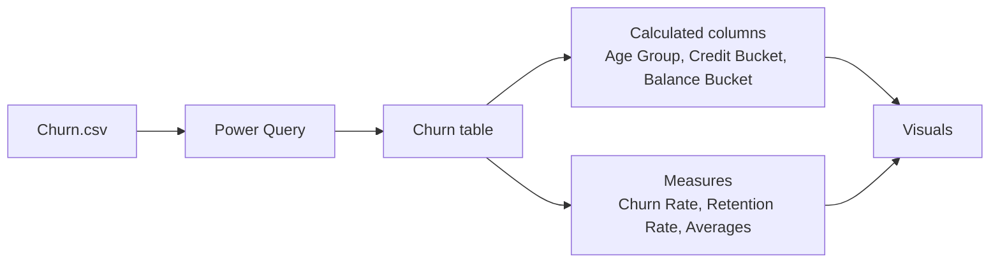

<p align="center">
  
</p>

<p align="center">
  
  
  
  
  
</p>

# Bank Customer Churn Analysis - Power BI Dashboard

An interactive, presentation-grade Power BI dashboard that shows **who leaves a bank, and why**. It covers 10,000 customers across France, Germany and Spain, and comes with a custom Figma-style dark background, a reusable Power BI theme, ready-to-paste DAX, and a full design guide.

---

## Table of contents
1. [Live preview](#live-preview)
2. [Project workflow](#project-workflow)
3. [Business problem](#business-problem)
4. [Dashboard preview](#dashboard-preview)
5. [Dataset](#dataset)
6. [Dashboard features](#dashboard-features)
7. [Key insights](#key-insights)
8. [Data model and DAX](#data-model-and-dax)
9. [Design system](#design-system)
10. [Repository structure](#repository-structure)
11. [Getting started](#getting-started)
12. [Roadmap](#roadmap)
13. [Contributing](#contributing)
14. [License](#license)
15. [Author](#author)

---

## Live preview
An animated sample of the finished look, running on dummy numbers. GitHub plays it automatically.

<p align="center">
  
</p>

## Project workflow

<p align="center">
  
</p>

| Step | Tool | What happens |
|---|---|---|
| 1. Dataset | CSV | Load the bank customer churn data (10K rows) |
| 2. Clean and shape | Power Query | Fix types, remove unused columns, create buckets |
| 3. Model and measure | DAX | Churn rate, retention rate, averages, comparisons |
| 4. Design | Figma / SVG | 16:9 dark background with panels, exported as PNG |
| 5. Build | Power BI Desktop | Place visuals on the panels, apply the theme, add interactivity |

## Business problem
Acquiring a new customer costs far more than keeping an existing one. This dashboard helps retention and marketing teams to:
- see the overall churn rate and how many customers are leaving,
- find which segments (age, country, gender, balance, credit score, activity) churn the most,
- decide where to aim retention offers first.

## Dashboard preview
Layout concept on the custom background (illustrative mock-up, not real data). Replace this with a screenshot of your finished report.


## Dataset
Public **Churn Modelling** bank customer dataset (10,000 rows), available for example on Kaggle. The data file is not included; put it in a `data/` folder (git-ignored) and load it into Power BI as a table named `Churn`.

| Column | Meaning |
|---|---|
| `CustomerId` | Unique customer ID |
| `CreditScore` | Credit score |
| `Geography` | Country (France, Germany, Spain) |
| `Gender` | Male or Female |
| `Age` | Age in years |
| `Tenure` | Years with the bank |
| `Balance` | Account balance |
| `NumOfProducts` | Number of bank products held |
| `HasCrCard` | 1 if the customer owns a credit card |
| `IsActiveMember` | 1 if the customer is active |
| `EstimatedSalary` | Estimated salary |
| `Exited` | 1 if the customer churned (target) |

## Dashboard features
- **Header KPIs:** total customers (10K), churn-rate gauge (20.4%), and a Churned / Stayed slicer.
- **Four donut charts:** activity status, gender, credit card ownership, and country split.
- **Three combo charts (columns for customers, line for churn rate):** by age group, by credit score bucket, and by balance bucket.
- **Cross-filtering:** every visual filters the others.
- **Custom canvas:** a dark background with card panels, so visuals sit cleanly in a grid.
- **Reusable theme:** one JSON file sets the colors, fonts, and transparent visuals.

## Key insights
Patterns visible in the dashboard. Confirm the exact numbers against your own report.

- Overall churn is about **one in five customers (20.4%)**.
- Churn is **not flat across age**: it rises in the middle-age groups and peaks around **51-60**, while the largest customer group (31-40) churns far less.
- **Very low credit scores (400 or below)** show a much higher churn rate, but there are few customers there, so the sample is small.
- **Balance matters**: a large group of customers hold a zero balance, and churn differs sharply across balance buckets.
- **Country, activity, and gender** all show visible gaps in churn, which makes them good targeting filters.

> Small buckets (for example, a handful of customers with a 100% churn rate) can look dramatic. Always read the rate together with the customer count.

## Data model and DAX
One flat table, `Churn`, plus calculated columns and measures.



Core measures (full list in [`docs/dax-measures.md`](docs/dax-measures.md)):

```dax
Total Customers   = COUNTROWS(Churn)
Churned Customers = CALCULATE([Total Customers], Churn[Exited] = 1)
Churn Rate        = DIVIDE([Churned Customers], [Total Customers])
Retention Rate    = 1 - [Churn Rate]
Avg Balance (Churned) = CALCULATE(AVERAGE(Churn[Balance]), Churn[Exited] = 1)
```

## Design system
Coral always means **churn**. Teal always means **retained**.


| Rule | Why |
|---|---|
| Max 3 main colors per page, plus one highlight | Keeps the report calm and readable |
| Mute normal bars (`#3A5073`), color only the key one | Draws the eye to the finding |
| Lines in yellow or white | Visible on the dark background |
| Faint gridlines (white at 8%) | Structure without noise |

**Canvas:** 16:9, 1280x720. Exact X/Y/W/H positions for every visual are in [`docs/design-guide.md`](docs/design-guide.md).

## Repository structure
```text
.
├── README.md
├── LICENSE
├── .gitignore
├── assets/
│   ├── banner.png / banner.svg
│   ├── live_dashboard.svg          # animated preview
│   ├── workflow.svg                # animated workflow
│   ├── dashboard_preview.png       # static mock-up
│   ├── palette.png / palette.svg
│   ├── dashboard_background.svg    # editable in Figma
│   ├── dashboard_background_1280x720.png
│   └── dashboard_background_2560x1440.png   # use this in Power BI
├── theme/
│   └── bank-churn-theme.json
├── docs/
│   ├── dax-measures.md
│   ├── design-guide.md
│   └── improvements.md
└── data/                           # your CSV goes here (git-ignored)
```

## Getting started
**Requirements:** Power BI Desktop (Windows) and the dataset CSV.

1. **Clone** the repo: `git clone https://github.com/<your-username>/bank-customer-churn-powerbi-dashboard.git`
2. **Load data:** put the CSV in `data/`, then in Power BI choose Get data, Text/CSV, and name the table `Churn`.
3. **Apply the theme:** View, Themes, Browse for themes, then select `theme/bank-churn-theme.json`.
4. **Set the background:** set the page size to 16:9 (1280x720). Then go to Format page, Canvas background, Image, choose `assets/dashboard_background_2560x1440.png`, set Image fit to Fit and Transparency to 0%.
5. **Add DAX:** paste the columns and measures from `docs/dax-measures.md`.
6. **Place visuals** using the coordinates in `docs/design-guide.md`. Set each visual's background to transparent, with no border and no shadow.
7. **Save** as `bank-churn.pbix`.

**Editing the background in Figma:** import `assets/dashboard_background.svg`, adjust the rounded panels (radius 14), and export as PNG at 2x.

## Roadmap
- [ ] Insight-style titles ("Germany churns at about 2x France")
- [ ] KPI row: churned customers, retention rate, average balance of churned, average credit score
- [ ] Age x Country churn heatmap and a top-5 risk segments table
- [ ] Key Influencers or Decomposition Tree page ("Drivers")
- [ ] Drill-through customer list and tooltip page
- [ ] Bookmarks, a reset button, and page navigation
- [ ] Churn probability model and an "at risk" customer count

More ideas in [`docs/improvements.md`](docs/improvements.md).

## Contributing
Suggestions and pull requests are welcome. Open an issue to discuss what you'd like to change, then fork the repo and submit a PR.

## License
Released under the [MIT License](LICENSE).

## Author
**Your Name**
- GitHub: [@your-username](https://github.com/your-username)
- LinkedIn: [your-profile](https://www.linkedin.com/in/your-profile)

If this project helped you, consider giving it a star.
